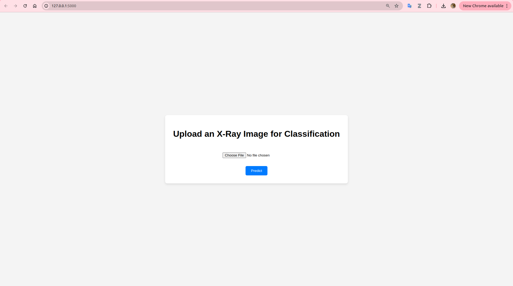
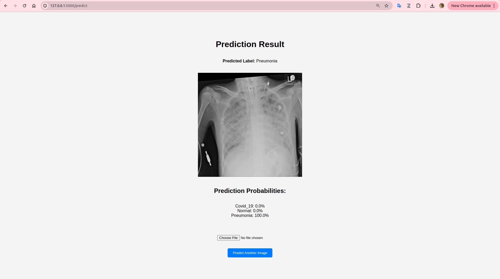

# covid19-xray-detection-flask-app
A Flask web application for predicting COVID-19, pneumonia and normal lung conditions from chest X-ray images using deep learning. 

## Model Model Training

- The model was trained using data from [this dataset](https://github.com/lindawangg/COVID-Net/tree/master)

- The model training method follows the same approach as outlined in [this repository](https://github.com/mr7495/covid19). The methodology is detailed in the associated [research paper](https://www.sciencedirect.com/science/article/pii/S2352914820302537?via%3Dihub).

I have used a concatenation of ResNet50V2 and Xception networks as the network for classifying the images into 
three classes: Normal, Pneumonia, and COVID-19.

<p align="center">
	
	<br>
	<em>The architecture of our model network</em>
</p>


## Installation

### Prerequisites

- Python 3.10+
- Flask
- TensorFlow 
- OpenCV
- Numpy

### Setup

1. Clone the repository:

   ```bash
   git clone https://github.com/lltlien/covid19-xray-predictor.git
   cd covid19-xray-predictor

2. Create and activate a virtual environment:

    ```bash
    virtualenv venv
    source venv/bin/activate  # On Windows, use `venv\Scripts\activate`

3. Install the required packages:

    ```bash
    pip install -r requirements.txt

4. - Download model to `covid19-xray-predictor` folder: [This link](https://github.com/lltlien/covid19-xray-detection-flask-app/releases/download/lastest/concatenate-fold3.hdf5)

5. Run the application:

    ```bash
    python3 app.py

6. Open your web browser and go to http://127.0.0.1:5000/ to use the app.

<p align="center">
	
	<br>
	
	<br>
    <em>The simple web app</em>

</p>